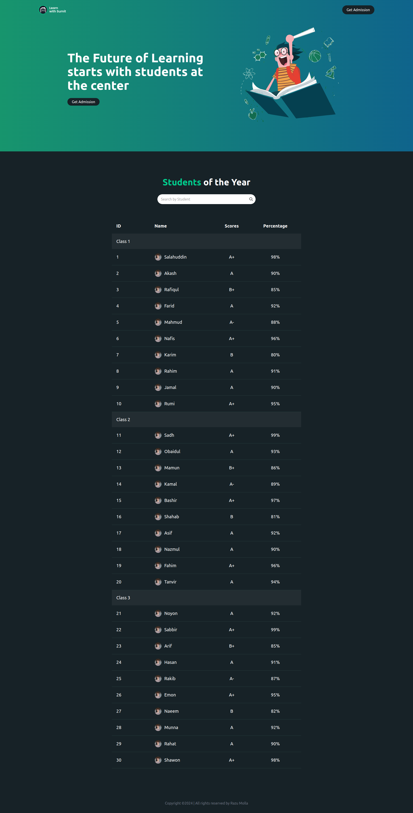

# Smart Grade Showcase

🚀 **Introducing Smart Grade Showcase!** 🚀

I'm excited to share my latest practice project - **Smart Grade Showcase**, a sleek and intuitive web application that highlights student performance in a visually appealing and organized manner. 🎓📊

### 🔍 Key Features:

- **Dynamic Data Rendering:** Student information is grouped and displayed by class, ensuring easy navigation and readability.
- **Search Functionality:** Quickly find any student by name using the built-in search feature.
- **Responsive Design:** Fully optimized for various screen sizes, ensuring accessibility and usability on all devices.

### 🌟 Technologies Used:

- **React.js:** For building the user interface.
- **Tailwind CSS:** For styling and responsive design.
- **JavaScript:** For handling the logic and data processing.

### 🛠️ Why This Project?

This project was a great opportunity to enhance my skills in frontend development, especially in using React and Tailwind CSS. It showcases my ability to create user-friendly and functional web applications.

Check out the project on GitHub and feel free to provide feedback or suggestions! 😊

🔗 [GitHub Repository](#) _(Replace with your actual GitHub link)_

#WebDevelopment #ReactJS #TailwindCSS #JavaScript #FrontendDevelopment #PracticeProject #SmartGradeShowcase
